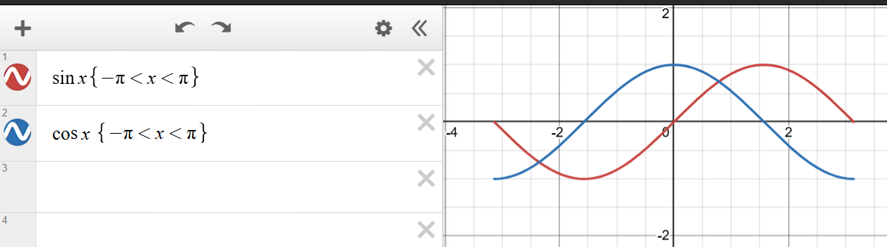
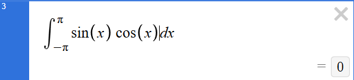

* content
{:toc}

# What

Part 1 of my notes on CVQKD.
This part mainly contains the basic definitions and certain keywords. Will probably need to be edited later after I have gained a more thorough understanding of the concepts 😭🥀

## keywords

### Gaussian states

A continuous variable Gaussian state is one whose phase-space quasi-probability distribution (e.g. the Wigner or characteristic function) is a multivariate Gaussian. The state is fully specified by its first and second statistical moments. An n mode Gaussian state r might have a Wigner function of the form

$$
W(r) = \frac{exp[-\frac{1}{2}(r - \hat{r})^T\Omega^-1(r - \hat{r})]}{\pi^n\sqrt{det\Omega}} 
$$

where $r$ is the mean quadrature vector and  is the $2n \times 2n$ covariance matrix. All physical Gaussian states obey the uncertainty principle $(+i  0)$.

### Quadratures

The quadratures of an optical mode are the two canonically conjugate observables (analogous to position q and momentum p). In CV-QKD these are usually written $\hat{q}$ (amplitude) and $\hat{p}$ (phase), which satisfies $\hat{q}, \hat{p} = i$ (setting $\bar{h} = 1$) and the uncertainty relation $\Delta\hat{q}, \Delta\hat{p} \ge 1$. One common definition is

$$
\hat{q} = a + a^2,  \hat{p} = a - ai2 
$$

where a  is the bosonic annihilation operator of the mode. These Hermitian operators generate the continuous variable phase space; their measurement outcomes (real values of $\hat{q}$ and $\hat{p}$) carry Alice’s encoded data in a CV-QKD protocol.

### Coherent states

A coherent state $\vert\alpha\rangle$ (with complex amplitude $\alpha$) is a quantum state of the quantum harmonic oscillator, whose behaviour is most similar to that of a classical harmonic oscillator. It is an eigenstate of the annihilation operator, $\hat{a}\vert\alpha\rangle = \alpha\vert\alpha\rangle$. It is a minimum uncertainty state, with the single free parameter chosen to make the relative dispersion equal for position and momentum. Their covariance matrix is the identity and their Wigner distribution is a circular Gaussian. 

In CV-QKD (e.g. the GG02 protocol), Alice typically prepares coherent states with Gaussian-distributed displacements; their average photon number is 2 and they behave most classically (as they resemble a point in phase space with vacuum noise)

### Squeezed states

A squeezed state is a Gaussian state in which one quadrature’s variance is reduced (squeezed) below the vacuum level at the expense of increasing (anti-squeezing) the other quadrature’s variance. Alternatively, a single-mode squeezed vacuum is $S(r)\vert0\rangle$, where the unitary squeeze operator is

with real squeezing parameter r. Under ideal squeezing, one finds $\Delta\hat{q} = e^-r$ and $\Delta\hat{p} = e^r$. Thus one quadrature’s noise is below the vacuum level ($\hat{q}$ < 1) while the conjugate is above ($\hat{p}$ > 1). Squeezed states are still Gaussian (completely specified by a mean and covariance). In CV-QKD, squeezed states can be used to improve the signal-to-noise in a chosen quadrature.

### modulation

In a CV-QKD protocol, modulating refers to Alice’s process of encoding classical information onto the quantum states by rotating or modifying their quadratures. For example, Alice might draw random numbers $(x, p)$ from a Gaussian distribution and use electro-optic modulators to shift a coherent state by $x$ in quadrature $\hat{q}$ and $p$ in quadrature $\hat{q}$. 

### demodulation

Demodulation refers to Bob’s measurement step. Bob interferes with the signal he receives using a strong local oscillator (in either homodyne or heterodyne detection) to measure one or both quadratures. Hence, “demodulating” means converting the optical quadrature measurement into a classical representation.

## Mathematical concepts

### Kronecker Product 

Very similar to the concept of tensor products but specialised for matrices instead of vectors, the kronecker product(denoted by the symbol $\otimes$) maps two arbtrarily sized matrices into a larger matrix with a specialised block structure. The kronecker product of arbitrary matrices A and B would contain every combination of any two terms(one each from A and B). 

The Kronecker product is commonly used to represent combined states, in a multi-qubit system. 

### Orthogonality (vectors)

When two vectors are linearly indepeendent of each other.

$$
\overrightarrow{v} = \sum_{j=1}^{n} v_j \hat{e}_j, \quad \hat{e}_j \cdot \hat{e}_i = \sigma_{ji}
$$

### Inner product of functions

This is building on the idea of treating functions as elements of vector space. (insert obligatory 'vectors are elements of vector space joke')

$$
f \cdot g = \lim_{\Delta x \rightarrow 0} [... + f(x-\Delta x)g(x-\Delta x)
                                               + f(x)g(x)
                                               + f(x+\Delta x)g(x+\Delta x)
                                               + ...]
$$

this can also be expressed as:

$$
f \cdot g = \int_{-\infty}^\infty{f(x)g(x)}dx
$$

If this inner product, $f \cdot g$ is 0, then the two functions are orthogonal.

For example:

$$
f(x) = sin(mx)
$$
$$
g(x) = cos(nx)
$$
$$
f \cdot g = \int_{-\pi}^\pi {sin(mx)cos(nx)}dx = 0
$$

Plotting the above on Desmos will give this:

Attempting to plot the integral gives 0. This tells us the two functions are orthogonal.

  

more coming soon...